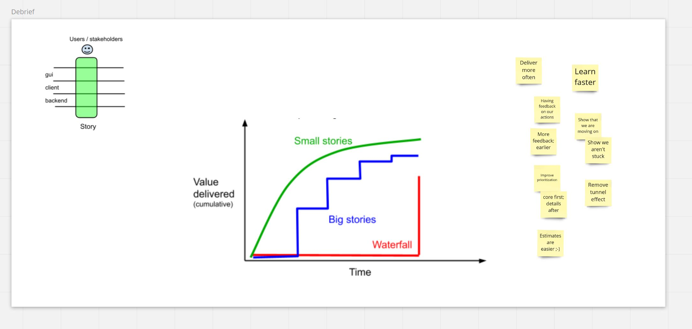
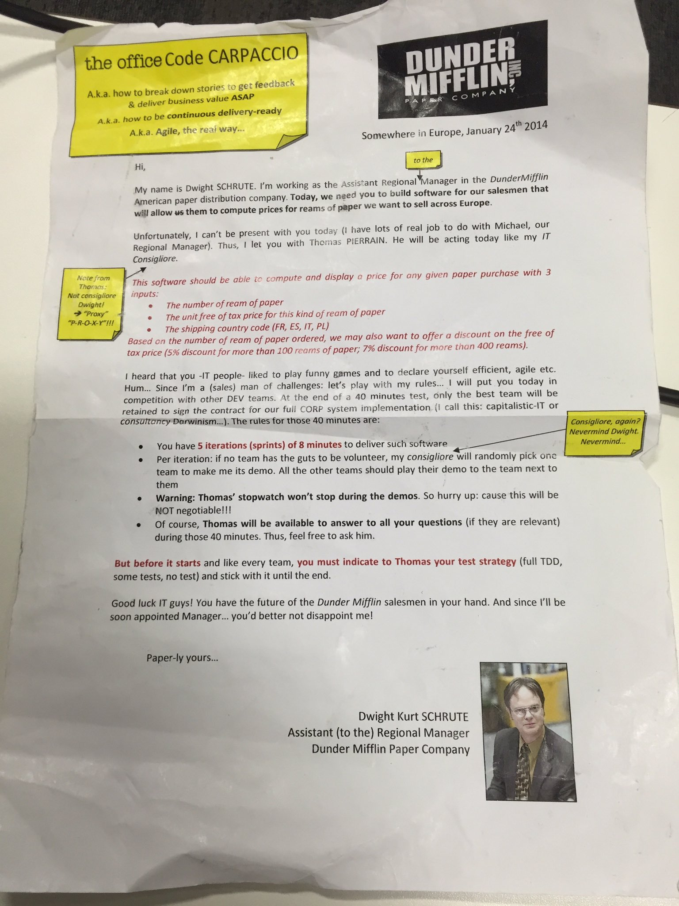
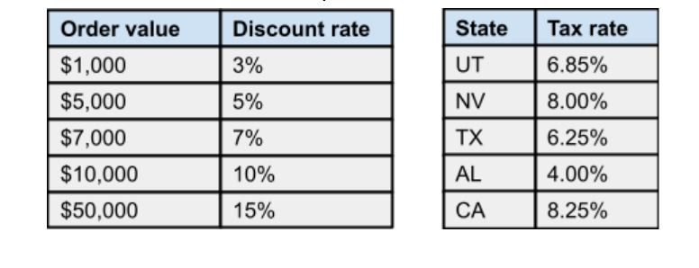

# kata-office-carpaccio
Instructions for the Elephant Carpaccio "the office edition" kata (i.e. Thomas' version of Alistair Cockburn kata; inspired this time by the Office tv series + an additional twist)

[(Some details on how Thomas did it the first time)](https://twitter.com/tpierrain/status/1126416897849819136?s=20)

## Instructions

1. Welcome people and ask them to add stickies (or paper) with their name (__1 minute__)
   - Tell them that they will have to work in pair or mob (sub groups) afterwards

1. Ask them a question (written on the white board): *"What is the value of splitting stories very small?"*

   - Give them __3 minutes to write down ideas on stickies__ 
   - Take __5 minutes to review all of them__
   - Take another __5 minutes to debrief and present Alistair's value curves__ 

1. Take __5 minutes to explain the overall schedule to the audience:__
    - They will have 20 minutes to write on paper 10-20 demo-able stories (slices) and to break-down them into 5 iterations (actually you will let them 10 more minutes for this analysis part, as explained further)
    - They will have 40 minutes in order to build an app for you in 5 iterations of 8 minutes (pairing or mobbing)
    
1. Gives them the following instructions and __10 minutes to read them carefully__ 

1. Let them ask you some questions about the instructions for __5 minutes__ and ask them to work in small group as of now

1. Give them __20 minutes__ in order to do the analysis and slicing of tiny and demo-able user stories (slices)

1. __After 7 minutes__: *"BREAKING-NEWS EVERYONE! Sorry, we've changed our mind and..."* ;-) 
    - "...and we've decided to target the US first. Thus, you can forget France, Italy, Spain and Poland regions and follow the rules in this addendum to the specifications
    - I've heard that you are Agile so... it shouldn't not be a problem for you...
    - ...Also, we've decided to change our discounting strategy. Instead of applying a discount depending on the number of paper reams, we want to apply a discount based on the total free-of-tax price as mentionned in the addendum

1. Tell them __they will have 10 more minutes__ to slice their stories and break-down them into 5 iterations

1. Gather them one last time before they start coding and clarifies whatever it takes. 
   - Then tell them they will have 5 iterations of 8 minutes, with a possible demo for you (the PO) every end of it.
   - Also tell them that the stopwatch won't stop between all these iterations
   - Ask them to define their testing strategy first (TDD, test after, no fucking test)
   - On your mark... set... go!

1. __5 iterations of 8 minutes__ (don't forget to trigger the stopwatch every time). While reviewing you can ask:
   - How many slices did you get so far?
   - How far did you get?
   - __*"I don't want to see code, I want to see something that run and accept my inputs"*__
     - *I'm buying 1 ream of paper with a 100$ unit (free of tax) cost in Texas ("TX"): what's the output? (solution: 106.85 $ tax included)*
     - *I'm buying 3 reams of paper with a 5$ unit (free of tax) cost in Utah ("UT"): what's the output? (solution: 16.03 $ tax included)*
     - *I'm buying 700 reams of paper with a 10$ unit (free of tax) cost in California ("CA"): what's the output? (solution: 7,047.08 $ tax included)*
     

1. Gather them for the final wrap-up (__15 minutes__)
   - Non-programmers: What was it like?
   - Programmers: What was it like?
   - What was difficult? How is your code? Did you managed to stick to your strategy (TDD, test-after, no-fucking-test)?
   - What did you learn? Will you change the way you slice your work?
   - What do you want to share?

